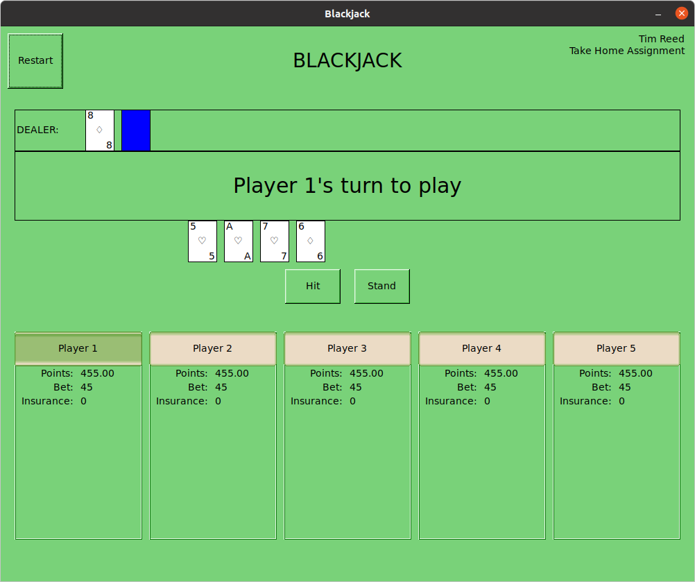
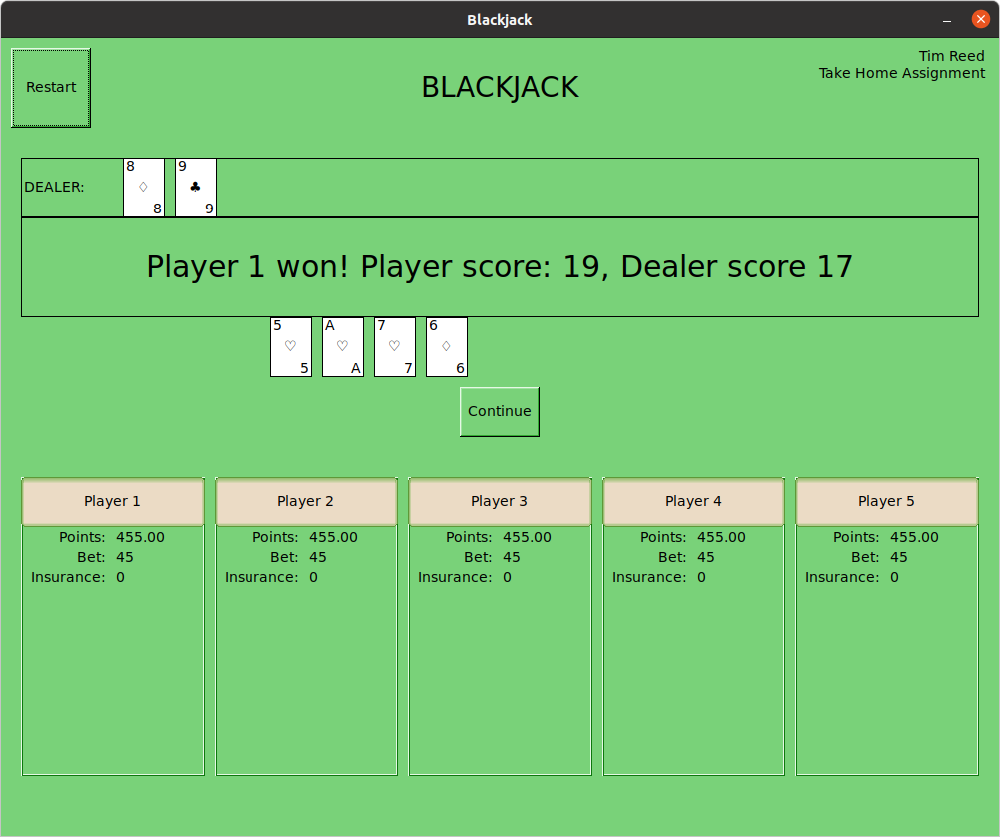

# Blackjack

Blackjack is a blackjack game with a Graphic User Interface.  The application is written in rust, and used the fltk-rs crate
to create the GUI.   

Rules and style of play vary from location to location, but this game was based off casino rules found on the 
[Bicycle](https://bicyclecards.com/how-to-play/blackjack/)
website.

This application can played with 1 to 6 players using 1 to 8 decks of playing cards.  If only one deck of cards
is used, the cards are reshuffled after every round of play.  For 2 or more decks, the "plastic cut card" is placed randomly
near the end of the deck.  When this card is played, it signals for the cards to be reshuffled at the end of the round.

Insurance betting is performed if the dealer's faced up card is an Ace, and pays 2-to-1.  
Blackjacks pay 3-to-2 and the dealer stands on a 'soft' 17.

## Dependencies

The application is written in rust, therefore the rust compiler will need to be installed. It can be found
[here](https://www.rust-lang.org/tools/install).  

The FLTK library used to create the GUI requires Rust, CMake, Git, and a C++11 compiler.  Without these installed,
the build process will fail when the dependencies are compiled.
Instructions from [FLTK's repository](https://github.com/fltk-rs/fltk-rs#dependencies) for installing these depedencies are copied here:  

>
>For Debian-based GUI distributions, that means running:
>```
>sudo apt-get install libx11-dev libxext-dev libxft-dev libxinerama-dev libxcursor-dev libxrender-dev libxfixes-dev libpango1.0-dev libpng-dev libgl1-mesa-dev libglu1-mesa-dev
>```
>For RHEL-based GUI distributions, that means running:
>```
>sudo yum groupinstall "X Software Development" && yum install pango-devel libXinerama-devel libpng-devel
>```
>For Arch-based GUI distributions, that means running:
>```
>sudo pacman -S libx11 libxext libxft libxinerama libxcursor libxrender libxfixes libpng pango cairo libgl mesa --needed
>```
>For Alpine linux:
>```
>apk add pango-dev fontconfig-dev libxinerama-dev libxfixes-dev libxcursor-dev libpng-dev mesa-gl
>```
>For NixOS (Linux distribution) this nix-shell environment can be used:
>```
>nix-shell --packages rustc cmake git gcc xorg.libXext xorg.libXft xorg.libXinerama xorg.libXcursor x
>```
 
## Building

Once the above dependencies are installed, building can be performed using `Cargo` in the project directory
(the directory with `Cargo.toml` in it):
```
cargo build --release
```

## Running

The application uses optional command line arguments to select the number of players and number of 
playing card decks used. Running:
```
cargo run -- --help
``` 
or
```
./target/release/blackjack --help
```
will display:
```
USAGE:
    blackjack [OPTIONS]

FLAGS:
    -h, --help       Prints help information
    -V, --version    Prints version information

OPTIONS:
    -d, --decks <decks>        Sets the amount of 52 card decks used [default: 6]
    -p, --players <players>    Sets the number of players fo the game [default: 4]

```

showing the optional flags of `-p` for number of players and `-d` for number of decks.  Valid ranges for
players is between 1 and 5 inclusive and for decks is 1 to 8 inclusive.  For example, a game with 5 players and 2 decks is:
```
cargo run -- -p 5 -d 2
```

These parameters are optional.  If not used, players default to 4 and decks default to 6.

## The Game
Play if from left to right. When bids are placed, this is reflected immediately in the individual player's section 
by the value for the bet changing, and the "points" of the playing dropping by the appropriate amount.  The value
of 'points' reflects how many 'points' the player has available to him/her (as if they were chips in front of you at the casino table).  

After betting, players play their hands using available options.  These options are Hit, Stand, Split, and Double.
 These actions are only displayed if they are avaiable to be played based on card count, types of cards, or points available.  
Splits or Doubles **are not available** if the player does not have enough points available to cover the new bet.



Once playing is done, the scores are settled and players are paid out according to the rules mentioned at the beginning.  




